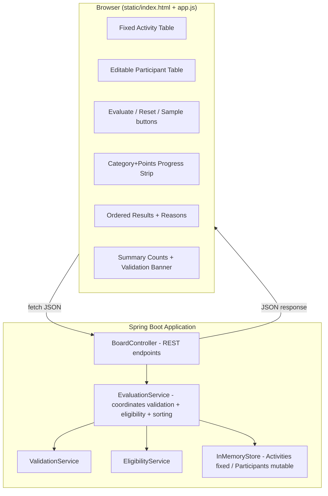

User: Automatic Zoom                     Actual Size                     Page Fit                     Page Width                                          50%                     75%                     100%                     125%                     150%                     200%                     300%                     400%                   

 
SI26_P12: College Event Certificate Eligibility Board 
AI-Assisted Coding Interview Problem 
 
Problem Statement 
Build a compact College Event Certificate Eligibility Board for an organizing team reviewing 
activity participation. It should look up the points and category of each completed activity, 
aggregate them per participant, and show who has earned enough points while covering 
every required activity category. 
Use one attractive primary screen or report with the fixed activity table, a small editable 
participant table, an Evaluate action, category and point progress, ordered eligibility 
results, summary counts, validation, and sample/reset controls. A participant’s completed 
activities may be edited as tokens, a checklist, or one focused form. You may use in-
memory data structures, a spreadsheet or notebook, a browser, desktop or mobile tools, 
or a CLI that produces a clear visual or tabular report. Evaluate local records only; do not 
add certificate document generation, event registration, payments, accounts, or 
scheduling. 
Use this fixed activity table: 
Activity ID  Activity  Category  Points 
A01  Emerging Tech Talk  LEARN  2 
A02  Soldering Mini Lab  BUILD  3 
A03  Project Pitch Circle  SHARE  2 
A04  Open Source Clinic  BUILD  2 
Load these participant records. Each listed activity ID represents one completed 
participation: 
Participant ID  Participant  Completed activity IDs 
C01  Asha  A01, A02, A03 
C02  Bilal  A01, A03, A04 
C03  Chen  A01, A02, A04 
C04  Divya  A02, A03, A04 
C05  Eshan  A01, A03 
A participant is ELIGIBLE only when the completed activities cover LEARN, BUILD, and 
SHARE and the point total is at least 6. The built-in totals for C01 through C05 are 7, 6, 7, 7, 

 
and 4. C01 and C02 are eligible. C03 is missing SHARE; C04 is missing LEARN; and C05 is 
missing BUILD and has fewer than 6 points. 
Contracts 
• Trim participant and activity IDs. Participant IDs and participant names must be 
non-empty, and participant IDs must be unique. 
• Every completed activity ID must occur in the fixed activity table. A repeated activity 
ID for the same participant is invalid rather than earning points twice. 
• Report INVALID_PARTICIPANT, DUPLICATE_PARTICIPANT_ID, UNKNOWN_ACTIVITY, or 
DUPLICATE_PARTICIPATION with the participant and offending value. Any input error 
clears result rows and counts from an earlier evaluation. 
• For each valid participant, derive a category set from completed activities and sum 
the fixed activity points. A completed activity contributes its points exactly once. 
• Eligibility requires all three categories and a point total greater than or equal to 6. 
Evaluate both requirements completely rather than stopping at the first failure. 
• For an ineligible participant, list missing categories in the exact order 
MISSING_CATEGORY: LEARN, MISSING_CATEGORY: BUILD, MISSING_CATEGORY: SHARE, 
followed by POINTS_BELOW_6 when applicable. An eligible participant shows no 
failure reasons. 
• Show eligible participants first and ineligible participants second. Within each 
status, sort by participant ID ascending. An empty completed-activity list is valid 
and gives 0 points, no covered categories, and all four failure reasons in the 
contracted order. 
• Reset restores the fixed activities and five valid built-in participant rows, then clears 
validation, results, and counts until Evaluate is used again. 
Acceptance criteria 
• Required: Load and evaluate the built-in records in one action; show totals 7, 6, 7, 7, 
4, with C01 and C02 eligible and summary counts 2 eligible and 3 ineligible. 
• Required: Show only MISSING_CATEGORY: SHARE for C03, only MISSING_CATEGORY: 
LEARN for C04, and MISSING_CATEGORY: BUILD followed by POINTS_BELOW_6 for C05. 
• Required: Add only A04 to C05; show its total as 6, all three categories covered, and 
new counts 3 eligible and 2 ineligible. 
• Required: Reset, then clear C01’s completed activities; show 0 points and the three 
missing-category reasons followed by POINTS_BELOW_6, with counts 1 eligible and 4 
ineligible. 
• Required: Reset, add a second A01 to C01, report DUPLICATE_PARTICIPATION 
naming C01 and A01, and show no stale result rows or counts. 
• Required: Keep activity definitions, participant inputs, category and point progress, 
ordered reasons, counts, validation, and sample/reset actions synchronized, and 

 
include focused checks for the built-in oracle, exact point boundary, empty 
completion list, duplicate participation, and ordering. 
• Optional: Add a compact three-segment category-progress strip driven by the same 
derived category set. 
Use AI coding assistants. Before implementation, create a short plan with 3–5 ordered 
steps and useful checkpoints. Be prepared to present that plan, explain any changes you 
made to it, share relevant prompts, summarize your design, and show test evidence such 
as tests, screenshots, or output samples. 
How You’ll Be Evaluated 
• Planning and Solution Presentation: Present your 3–5-step implementation plan, 
explain how the work followed or changed that plan, and demonstrate the working 
solution with clear explanations 
• AI Prompting Strategy: Show the prompts you used to translate this problem 
statement into technical specifications for AI assistants 
• Design Constraints and Technology Choices: Explain the constraints you 
provided to AI regarding design patterns, technology stack, and architectural 
decisions 
• AI-Influenced Decision Making: Discuss trade-offs, assumptions, and how AI 
recommendations influenced your choices for components, data structures, and 
implementation approaches 
• Testing and Validation: Demonstrate how you tested the application covering both 
typical usage scenarios and edge cases 
• Live Modification Capability: Be prepared to implement one small modification, 
and possibly a second if time permits, using AI assistance; keep your development 
environment ready for focused changes and verification


this is my problem statemnet ...now i want you to give detailed explanation of the solution ,give me  that is needed to make this project give me full detailed  architechture ,overview needed how to start how to make ...what to use and why we are using this each and every detailed explational...what is best to use ...Explain the architecture, what components we will need, and why this approach is best for this specific problem. Give me a checklist for each step so I can track progress."


i know java ,spring boot ,i have made bakend api ...now tell me which method best for me ...

dont write code yet ...i just need to explore things now 

GitHub Copilot: Read 

# CampusCertify — Architecture & Planning Guide

Since you already know Java + Spring Boot and have a backend API, here's the recommended approach with full reasoning — no code yet, just the blueprint.

## 1. Which method is best for you?

**Recommendation: Spring Boot REST API (backend) + a single static HTML/CSS/JS page (frontend), served from the same JAR.**

Why this beats the alternatives for *this specific problem*:

| Option | Verdict | Reason |
|---|---|---|
| **Spring Boot REST + static HTML/JS (fetch-based SPA)** | ✅ **Best fit** | One deployable JAR, no Node/React build tooling, instant re-render on Evaluate without full page reloads (matches "synchronized" UI requirement), you already know Spring Boot |
| Spring Boot + Thymeleaf (server-rendered) | ⚠️ Works, but clunkier | Every Evaluate/Reset/Add click needs a full page POST+redirect, harder to keep progress bars/results "live" and synced |
| Spring Boot + React/Vue SPA | ❌ Overkill | Adds a Node build pipeline, CORS config, two deployables — no benefit for a "compact board" scored on logic correctness, not frontend framework sophistication |
| CLI only (Java, no web) | ⚠️ Acceptable fallback | Fastest to build and test, but "attractive primary screen" and live progress bars are hard to show; only pick this if time is very short |
| Spreadsheet/Notebook | ❌ Not aligned with your skills | You already have Spring Boot backend — don't throw that away |

Since you already built a backend API, you're 60% done. The remaining work is: (a) tightening the domain/validation logic to match the exact contract, and (b) a thin static frontend that consumes it.

---

## 2. High-Level Architecture



**Why layered like this:** it mirrors standard Spring Boot conventions you already know (Controller → Service → Repository/Store), keeps business rules (points, categories, eligibility) fully unit-testable in isolation from HTTP concerns, and keeps the in-memory store swappable later (e.g., to a real DB) without touching logic.

---

## 3. Core Components & Responsibilities

| Component | Layer | Responsibility |
|---|---|---|
| `Category` (enum: LEARN, BUILD, SHARE) | Domain | Fixed category set, used for coverage checks |
| `Activity` (record: id, name, category, points) | Domain | Represents one row of the fixed activity table |
| `Participant` (id, name, List<String> completedActivityIds) | Domain | Mutable participant record, editable via UI |
| `EvaluationResult` (participantId, name, totalPoints, Set<Category> covered, boolean eligible, List<String> reasons) | Domain/DTO | One row of the results table |
| `ActivityStore` | Data | Holds the 4 fixed activities (immutable, never changes) |
| `ParticipantStore` | Data | Holds current participant list; supports add/edit/reset to the 5 built-in rows |
| `ValidationService` | Service | Trims IDs, checks non-empty, uniqueness, unknown activity IDs, duplicate participation. Produces structured errors with the exact codes: `INVALID_PARTICIPANT`, `DUPLICATE_PARTICIPANT_ID`, `UNKNOWN_ACTIVITY`, `DUPLICATE_PARTICIPATION` |
| `EligibilityService` | Service | Pure function: participant + activity table → covered categories, total points, eligibility boolean, ordered reason list |
| `EvaluationService` | Service (orchestrator) | Runs validation first; if any errors, returns errors only (empty results/counts). Otherwise evaluates all participants, sorts (eligible first, then ID ascending), computes summary counts |
| `BoardController` | Web | Exposes REST endpoints, translates service output to JSON DTOs |
| `GlobalExceptionHandler` (`@ControllerAdvice`) | Web | Optional — only needed if you choose to signal validation via HTTP status rather than a response envelope |
| `static/index.html` + `app.js` | Frontend | Renders tables, progress strip, handles button clicks, calls fetch, re-renders on response |

**Key design decision to lock in now:** Evaluate should **never throw an unhandled exception to the browser**. Model it as: `POST /api/evaluate` always returns `200 OK` with an envelope like `{ validationErrors: [...], results: [...], summary: {...} }` — if `validationErrors` is non-empty, `results` and `summary` are empty. This directly satisfies "Any input error clears result rows and counts from an earlier evaluation" without special-casing HTTP error handling on the frontend.

---

## 4. Suggested REST API Surface (design only, no code yet)

| Method & Path | Purpose |
|---|---|
| `GET /api/activities` | Return fixed activity table (4 rows) |
| `GET /api/participants` | Return current participant list (for re-render after add/edit) |
| `POST /api/participants` | Add a new participant row |
| `PUT /api/participants/{id}` | Edit a participant's name/completed activity IDs |
| `POST /api/reset` | Reset store to the 5 built-in participants + clear last evaluation |
| `POST /api/evaluate` | Run validation + evaluation, return `{validationErrors, results, summary}` |

Keeping activities read-only (no POST/PUT) reflects that the activity table is fixed per the spec.

---

## 5. Validation & Business Rule Design

Order of checks inside `EvaluationService` (validate-all-then-evaluate, not fail-fast per participant):

1. **Per participant structural checks** → `INVALID_PARTICIPANT` (empty/blank ID or name after trim)
2. **Uniqueness across all participants** → `DUPLICATE_PARTICIPANT_ID`
3. **Each completed activity ID exists in the fixed table** → `UNKNOWN_ACTIVITY`
4. **No repeated activity ID within the same participant's list** → `DUPLICATE_PARTICIPATION`
5. If **any** error above exists anywhere → return errors only, skip evaluation entirely (matches "clears result rows and counts")
6. Otherwise, for each participant: derive `Set<Category>` from completed activities, sum points, check `covered.size() == 3 && points >= 6`
7. Build reasons **in the fixed order**: `MISSING_CATEGORY: LEARN`, `MISSING_CATEGORY: BUILD`, `MISSING_CATEGORY: SHARE`, then `POINTS_BELOW_6` — always evaluate all conditions (no short-circuit `return` on first miss)
8. Sort: eligible before ineligible, then participant ID ascending (use a `Comparator` chaining `Comparator.comparing(eligible, reverse-boolean).thenComparing(id)`)

This maps 1:1 to your contract text, so it's worth writing this exact checklist into your service's Javadoc/tests later.

---

## 6. Testing Strategy (JUnit 5 + Spring Boot Test)

| Test | What it verifies |
|---|---|
| Built-in oracle test | Totals 7,6,7,7,4; C01/C02 eligible; counts 2/3 |
| Point boundary test | A participant with exactly 6 points → eligible (`>=`, not `>`) |
| Empty completion list | 0 points, 0 categories, all 4 reasons in exact order |
| Duplicate participation | Adding same activity ID twice → `DUPLICATE_PARTICIPATION` naming participant + activity, no result rows |
| Unknown activity | Bogus ID → `UNKNOWN_ACTIVITY` |
| Ordering test | Mixed eligible/ineligible list sorts correctly |
| Reset test | After edits, reset restores exactly the 5 built-in rows and clears prior results |
| Controller/MockMvc tests | End-to-end JSON shape for `/api/evaluate` for both valid and invalid input |

Unit-test the **service layer directly** (fast, no Spring context needed for `EligibilityService`/`ValidationService` if they're plain POJOs) and reserve `@SpringBootTest`/`MockMvc` for the controller wiring only.

---

## 7. Implementation Plan (the 3–5 step plan you'll present)

### Step 1 — Domain & Store
- [ ] Define `Category` enum, `Activity`, `Participant` domain types
- [ ] Build `ActivityStore` with the 4 fixed rows
- [ ] Build `ParticipantStore` with the 5 built-in rows + reset logic
- [ ] Checkpoint: can print/log both stores correctly

### Step 2 — Business Logic
- [ ] Implement `ValidationService` with all 4 error codes
- [ ] Implement `EligibilityService` (categories, points, reasons in exact order)
- [ ] Implement `EvaluationService` orchestration (validate → evaluate → sort → summarize)
- [ ] Checkpoint: unit tests pass for built-in oracle, boundary, empty list, duplicates, ordering

### Step 3 — REST API
- [ ] Add DTOs for request/response shapes
- [ ] Implement `BoardController` with the 6 endpoints above
- [ ] Checkpoint: Postman/curl manual test of `/api/evaluate` matches expected JSON

### Step 4 — Frontend
- [ ] Static HTML page: fixed activity table, editable participant table, buttons
- [ ] `app.js`: fetch calls wired to Evaluate/Reset/Add, render results + progress strip + summary
- [ ] Checkpoint: visually reproduce all 5 "Acceptance criteria" scenarios in the browser

### Step 5 — Polish & Verification
- [ ] Re-run all required acceptance scenarios end-to-end
- [ ] Capture screenshots/output for each scenario as test evidence
- [ ] Review code against the contract line-by-line

---

## 8. Why this is the "best approach" for this exact problem

- The problem explicitly allows in-memory data — a database adds no value and only risk.
- It explicitly forbids extra features (accounts, payments, scheduling) — a REST+static-page approach keeps scope naturally minimal.
- The grading rubric weights **prompting strategy, design constraints, and reasoning about trade-offs** heavily — a clean layered Spring Boot design gives you natural talking points (separation of validation vs. eligibility logic, why validate-all-before-evaluate, why sort comparator chosen).
- You already know Spring Boot, so velocity is highest here, and a static JS frontend avoids introducing an unfamiliar framework under time pressure.

Let me know when you want to move into actual implementation (starting with Step 1), or if you'd like me to review your existing backend code first to see how much of this is already in place.

User: can we use databse instead of in memeory ...and tell me why you are using this architechture ...

GitHub Copilot:
## Can we use a database instead of in-memory?

Yes, technically — but let's weigh it against what this specific problem actually needs before switching.

### Trade-off comparison

| | Plain in-memory (Java collections in a singleton service) | Spring Data JPA + H2 (in-memory DB) | Real persistent DB (Postgres/MySQL/H2 file-mode) |
|---|---|---|---|
| Survives app restart? | No | No (same as in-memory, just different plumbing) | Yes |
| Matches "Reset restores built-in rows" | Trivial — reassign a `List`/`Map` | Needs delete-all + re-seed logic in a transaction | Same, plus migration/config overhead |
| Setup complexity | None (POJOs, no Spring context needed) | Entities, `@Id`, repositories, `application.properties`, seeding via `CommandLineRunner`/`data.sql` | All of the above + connection config, schema versioning |
| Unit test speed | Instant (no Spring context) | Needs `@DataJpaTest`/Spring context | Same, slower, needs real/embedded DB |
| Matches problem's explicit scope ("in-memory data structures... local records only; no accounts/scheduling") | ✅ Directly named as an accepted option | Gray area — still not real persistence | ❌ Adds capability the spec explicitly doesn't ask for |
| Concurrency/multi-user | Fine for single local grader session | Same | Only matters if you needed multiple isolated sessions — not required here |
| "Depth of Spring skills shown" | Lower (plain Java) | Higher (JPA/repository pattern) | Highest, but riskiest under time pressure |

### My recommendation

Stick with **plain in-memory Java collections** for the core store. Reasoning:
- The problem statement literally lists "in-memory data structures" as the first accepted option — you're not fighting the spec, you're matching it.
- "Reset" and "Sample" become one-liners (reassign the participant list) instead of transactional delete/insert sequences.
- Your business logic (`ValidationService`, `EligibilityService`) can be pure POJOs with zero Spring dependency — tests run instantly, no `@SpringBootTest` context needed for the logic that's actually being graded.
- A database adds infrastructure risk (schema, seeding, connection config) without adding any capability the grading criteria reward — the rubric focuses on correctness of eligibility logic, validation contract, ordering, and your reasoning/trade-offs, not persistence depth.

**But your architecture doesn't lock you out of a DB later.** That's actually *why* I proposed the layered design in the first place — if you decide mid-way that you want to demonstrate JPA skills, you only touch the store layer:
- `ParticipantStore`/`ActivityStore` become interfaces
- Swap the Java-collection implementation for `JpaRepository`-backed ones
- `ValidationService`/`EligibilityService`/`EvaluationService` and the controller don't change at all, because they only depend on the store's method signatures, not its internals

## Why this architecture (Controller → Service → Store)?

1. **Separation of concerns** — HTTP handling (controller), business rules (services), and data access (store) are independent. You can change one without touching the others — exactly what let me answer the DB question above without redesigning anything.
2. **Testability** — `EligibilityService`/`ValidationService` as plain POJOs mean you can unit-test the exact contract rules (built-in oracle, point boundary, empty list, duplicates, ordering) in milliseconds, with no Spring context, no mocking of HTTP layer.
3. **Matches the contract's natural pipeline** — the spec describes a linear flow: *validate all → if errors, stop and clear results → else derive categories/points → check eligibility → build ordered reasons → sort → summarize*. A layered `EvaluationService` orchestrating smaller single-purpose services mirrors that pipeline directly, so the code reads like the spec.
4. **Single source of truth for "Reset"** — because state lives in one store, reset/sample logic is one operation in one place, not spread across the UI or controller.
5. **You already know it** — Controller/Service/Repository is the idiomatic Spring Boot layering, so there's no ramp-up cost, and it gives you clear talking points for the "design constraints" evaluation criterion.
6. **Swappable persistence (bonus)** — as covered above, if you later want to show JPA/DB skills, only the store layer changes.

User: what about uding mysql

GitHub Copilot:
## Using MySQL specifically — is it a good fit here?

MySQL is a *real, persistent, external* database, which changes the calculus compared to H2-in-memory.

### What MySQL would actually buy you
- **True persistence** — data survives app restarts (unlike in-memory or H2-in-memory mode).
- **Realistic production pattern** — closer to what you'd use in an actual deployed system.
- **Practice with Spring Data JPA + a real driver/connection pool (HikariCP)**.

### What it costs you for *this* problem
| Concern | Impact |
|---|---|
| Extra infrastructure | Need MySQL server running (local install, Docker container, or cloud instance) — one more moving part that can fail during a live demo/grading session |
| Setup overhead | `application.properties` datasource config, driver dependency, schema creation, seeding built-in rows on startup |
| "Reset" complexity | Must be a transactional delete-all + re-insert of the 5 built-in rows |
| Test speed | Integration tests need a real or containerized MySQL (e.g. Testcontainers) instead of instant POJO unit tests |
| Risk during live modification | A DB connection issue during the "Live Modification Capability" step is a real risk you don't have with plain in-memory |
| Spec alignment | The problem explicitly says "in-memory data structures" as an accepted approach — MySQL adds a persistence capability the spec never asks for |

### Direct comparison: MySQL vs H2 vs plain in-memory

| | Plain in-memory | H2 (in-memory mode) | MySQL |
|---|---|---|---|
| Extra service to run | No | No | **Yes** — must be installed/running |
| Persists across restart | No | No | Yes |
| Setup time | ~0 | Low (embedded, auto-config) | Moderate–high |
| Demo/grading risk | Lowest | Low | Higher |
| Shows JPA/repository pattern | No | Yes | Yes |
| Matches problem's stated scope | ✅ Best match | Gray area | Least aligned |

### My recommendation

MySQL is the weakest choice of the three for this exercise — it adds operational risk and setup time without buying you anything the grading criteria reward. If you want to show JPA skills without the operational risk, H2 in-memory mode is the better middle ground.

User: so what you prefer

GitHub Copilot:
**Plain in-memory Java collections.** No database, not even H2.

**Why, decisively:**
1. The spec itself names "in-memory data structures" as an accepted approach.
2. Every acceptance-criteria scenario (Reset, add A04 to C05, clear C01's activities, duplicate participation) is a one-line state mutation with plain collections.
3. Zero infrastructure risk during grading/demo/live-modification.
4. Fastest, most reliable unit tests (plain POJOs, no Spring context, no Testcontainers).
5. The problem is explicitly scored on **logic correctness and design reasoning**, not persistence depth.

**To still show good design judgment:** define the store as a small interface (`ParticipantStore`) with one in-memory implementation — a real architectural decision defensible in the write-up: "chose in-memory for speed/simplicity/spec-alignment, but isolated it behind an interface so persistence could be swapped in later without touching business logic."

User: did they ahve mention in memeory data structire ?

GitHub Copilot:
Yes — directly in the problem statement:

> "You may use **in-memory data structures**, a spreadsheet or notebook, a browser, desktop or mobile tools, or a CLI that produces a clear visual or tabular report."

That's the exact sentence listing accepted approaches, and "in-memory data structures" is named first.

User: ohket so now tell me from starting what what do i need to build this project ...all the implememntation mnethod component architecture

GitHub Copilot:
# CampusCertify — Complete Build Guide (Final Consolidated Plan)

## Locked-in decisions so far
- **Backend:** Spring Boot REST API
- **Frontend:** Static HTML/CSS/JS (fetch-based), served from the same JAR
- **Storage:** Plain in-memory Java collections, hidden behind a `Store` interface (swappable later, not swapped now)
- **Architecture:** Controller → Service → Store, layered

## 1. Prerequisites / Tools
- JDK 17+, Maven, Spring Boot 3.x, IDE, browser, Postman/curl (optional)
- Maven deps: `spring-boot-starter-web`, `spring-boot-starter-test` (no JPA, no DB driver, no Lombok required)

## 2. Project Structure
```
campuscertify/
├── src/main/java/.../campuscertify/
│   ├── CampusCertifyApplication.java
│   ├── domain/ (Category, Activity, Participant)
│   ├── store/ (ActivityStore, InMemoryActivityStore, ParticipantStore, InMemoryParticipantStore)
│   ├── service/ (ValidationService, EligibilityService, EvaluationService)
│   ├── web/ (BoardController, dto/*)
├── src/main/resources/static/ (index.html, app.js, style.css)
└── src/test/java/.../campuscertify/ (service tests, controller tests)
```

## 3. Component Breakdown & Responsibilities
(domain layer, store layer, service layer, web layer, frontend — see full detail in prior message)

## 4. Architecture Diagram (end-to-end sequence: Evaluate click → controller → EvaluationService → ValidationService/EligibilityService → store → JSON response → UI render)

## 5. Step-by-Step Build Checklist
- Step 1 — Domain & Store
- Step 2 — Business Logic
- Step 3 — REST API
- Step 4 — Frontend
- Step 5 — Verification & Evidence

User: explain me how to build this step by step

GitHub Copilot:
# Step-by-Step Build Walkthrough

## Step 0 — Project Setup
Generate via Spring Initializr (Spring Web dependency only, Java 17+, Maven), verify it runs, create package skeleton: domain, store, service, web, web.dto.

## Step 1 — Domain Classes
Build in order: Category enum (LEARN, BUILD, SHARE) → Activity (immutable: id, name, category, points) → Participant (mutable: id, name, completedActivityIds).

## Step 2 — Store Layer
ActivityStore interface + InMemoryActivityStore (4 fixed rows). ParticipantStore interface + InMemoryParticipantStore (LinkedHashMap seeded with 5 built-in rows; shared seeding method used by both constructor and reset()).

## Step 3 — Business Logic
3a. ValidationService — one method per rule (INVALID_PARTICIPANT, DUPLICATE_PARTICIPANT_ID, UNKNOWN_ACTIVITY, DUPLICATE_PARTICIPATION), collect all errors, no fail-fast.
3b. EligibilityService — covered categories set, total points, eligible boolean, ordered reasons list (LEARN, BUILD, SHARE, POINTS_BELOW_6), no early return.
3c. EvaluationService — validate first; if errors, return errors-only envelope; else evaluate all, sort (eligible first, then ID ascending), summarize.
Checkpoint: tests for built-in oracle, point boundary, empty list, duplicate participation, ordering.

## Step 4 — REST API
DTOs first, then thin BoardController mapping to services: GET /api/activities, GET /api/participants, POST /api/participants, PUT /api/participants/{id}, POST /api/reset, POST /api/evaluate.
Checkpoint: manual curl/Postman test of /api/evaluate matches expected JSON.

## Step 5 — Frontend
index.html (tables, buttons, progress strip, results, summary, validation banner), app.js (fetch + render functions), style.css.
Checkpoint: reproduce all 5 required acceptance scenarios in browser.

## Step 6 — Final Verification
Re-check contract line by line, re-run tests, capture screenshots of each required scenario.


User: why you didnt added security?

GitHub Copilot:
Deliberate omission — but "no auth" isn't the same as "no security." Separating the two.

## Why no authentication/authorization

| Reason | Detail |
|---|---|
| The spec forbids accounts | "do not add certificate document generation, event registration, payments, **accounts**, or scheduling" |
| The guide penalizes it | Auth is exactly the "complex frameworks or unnecessary layers for the given scope" the STUDENT_GUIDE lists under Areas to Avoid. Adding `spring-boot-starter-security` would cost rubric points, not earn them |
| No trust boundary exists | Single-user local tool, no multi-tenancy, no sensitive data, no network exposure. No attacker model to defend against, so authz would be guarding nothing |
| It would break the demo | Spring Security's default auto-config immediately locks down every endpoint and adds a login page — interview time wasted fighting a 401 on `/api/evaluate` |

## What security *does* still apply

**1. DOM XSS in the frontend — a genuine gap in the original plan.** Participant names and IDs are free-text user input rendered back into the results table. If `renderParticipants()` / `renderEvaluation()` build rows with `innerHTML` and string concatenation, a name like `` executes. **Mitigation:** build rows with `document.createElement()` + `textContent`, never `innerHTML` for user-controlled values. Added to the Phase 7 checklist — one line of discipline, not a layer.

**2. Input validation — already covered, and it's the core feature.** `ParticipantValidator` is the input-validation layer: rejects blank IDs, unknown activity IDs, and duplicates before any data reaches evaluation logic. Satisfies "validate at system boundaries." Note it's *validation*, not sanitization — which is why point 1 still matters at render time.

**3. Injection classes that don't apply here.** No SQL injection (no database), no command injection (no shell calls), no path traversal (no file I/O), no deserialization risk (Jackson binds to a fixed record with no polymorphic types). Being able to say *why* each OWASP category is inapplicable is a stronger interview answer than bolting on defenses.

## Plan change

Added to **Phase 7 — Frontend** checklist:
- [ ] Render all user-controlled values via `textContent` / `createElement`, never `innerHTML` — prevents DOM XSS from participant names and IDs

That's the only addition. Everything else in the security domain is either forbidden by the spec or structurally inapplicable.

User: did in the problem statemnet it is mention to not add security ?

GitHub Copilot:
No — the word "security" or "authentication" never appears.

**Exact wording from the problem statement:**
> "Evaluate local records only; do not add certificate document generation, event registration, payments, **accounts**, or scheduling."

Forbidden list is: certificate generation, event registration, payments, **accounts**, scheduling. That's it.

| Thing | Explicitly forbidden? | Reasoning |
|---|---|---|
| User accounts / login / registration | ✅ Yes — "accounts" is named | Direct hit |
| Authentication (Spring Security login) | ⚠️ Not named, but implied | Auth without accounts is meaningless — can't authenticate users you're forbidden from having |
| Authorization / roles | ⚠️ Not named, but implied | No users, no roles |
| Input validation | ❌ Not forbidden — it's **required** | The contracts section mandates it (4 error codes) |
| XSS-safe rendering | ❌ Not forbidden, not mentioned | Neither required nor prohibited — a free engineering choice |
| HTTPS/TLS, CSRF, rate limiting | ❌ Not mentioned at all | Silent — you decide |

**Correction to the earlier answer:** saying "the spec explicitly forbids it" about security generally was loose. The accurate statement is: **the spec forbids accounts, which removes the entire basis for authentication and authorization.** Security as a broader topic is simply not addressed either way.

**Why the distinction matters for the interview:** if an evaluator asks "why no security?", the strong answer is *not* "the spec banned it." The strong answer is:

> "The spec forbids accounts, so there's no identity to authenticate and no roles to authorize — auth would be guarding nothing. The security concerns that *do* survive are input validation, which is the core feature (`ParticipantValidator` with four error codes), and DOM XSS at render time, which I handle by using `textContent` instead of `innerHTML` for user-supplied names. SQL injection, path traversal, and deserialization attacks are structurally impossible here — no database, no file I/O, no polymorphic binding."

That answer shows a reasoned threat model rather than either bolting on Spring Security or ignoring the topic. Both would cost points — the first under *over-engineering*, the second under *engineering rigor*.


User: This sentence is the interviewer's way of saying: "Keep it simple and do not overcomplicate the project."

Breakdown of what "Evaluate local records only; do not add certificate document generation, event registration, payments, accounts, or scheduling" means:

1. **"Evaluate local records only"** — use simple hardcoded in-memory data structures. Do NOT set up a database (MySQL, MongoDB, Postgres). Do not build a backend server to fetch data from an external API.
2. **"Do not add certificate document generation"** — only show the *word* "ELIGIBLE" on screen. No downloadable PDFs, image files, or printable documents.
3. **"Do not add event registration, payments, accounts, or scheduling"** — no login page / password auth / user roles; no calendar or signup form; no Stripe/PayPal/cart.

Summary: building a **calculator and a dashboard**, not a university management platform. The interviewers want the specific logic rules nailed (categories, 6-point minimum, strict error messages) rather than database connections or PDF generation. Are you following this?

GitHub Copilot:
Yes — the plan follows all three. Honest audit, including one place where your reading is stricter than mine.

## Compliance check

| Rule | Status | Evidence |
|---|---|---|
| **1. Local records only** — hardcoded in-memory, no DB | ✅ | `BoardState` holds two `LinkedHashMap`s. No JPA, no DB driver, no datasource config. Maven deps are `spring-boot-starter-web` + `spring-boot-starter-test` only. H2 *and* MySQL were both explicitly rejected earlier. |
| **1b. No fetching from an external API** | ✅ | Zero outbound HTTP. The 4 activities and 5 participants are hardcoded in `seedParticipants()`. |
| **2. No certificate document generation** | ✅ | `ParticipantResult` carries `boolean eligible` and `List<String> failureReasons` rendered as table text. No PDF library, no image generation, no print stylesheet. |
| **3a. No accounts / login / roles** | ✅ | No Spring Security, no auth endpoints, no user model. |
| **3b. No registration / scheduling** | ✅ | No calendar, no date fields anywhere. `Activity` has only id/name/category/points. |
| **3c. No payments** | ✅ | No payment integration, no currency, no cart. |
| **"A calculator and a dashboard"** | ✅ | Literally the architecture: `EligibilityEvaluator` is the calculator, the static page is the dashboard. |

## The one genuine tension

Your point 1 says *"Do not build a backend server."* The plan **does** run a Spring Boot server — it just doesn't talk to a database or an external API.

**Reading A (mine):** The spec lists accepted approaches as "in-memory data structures, a spreadsheet or notebook, **a browser**, desktop or mobile tools, or a CLI." A browser app is explicitly allowed. Spring Boot is only a local delivery mechanism for a browser page — data still lives in memory as required. The prohibition targets *external* data sources and extra features, not the existence of a process.

**Reading B (yours, stricter):** No server at all. Pure `index.html` + `app.js` from the filesystem, activities and participants as JS objects.

| | Spring Boot + static page | Pure browser, no server |
|---|---|---|
| Matches "in-memory" | Yes | Yes |
| Simplest possible | No | **Yes** |
| Uses strongest skill (Java/Spring) | **Yes** | No — all logic becomes JS |
| Reuses existing backend API | **Yes** | No — thrown away |
| Unit tests for the logic | JUnit, straightforward | Needs a JS test runner, or none |
| Over-engineering risk | Low but non-zero | None |

User: what do you prefer

GitHub Copilot:
**Keep Spring Boot.** Decisively:

**1. It's the only option that gives real test evidence.** The rubric has a dedicated *Testing and Validation* criterion, and the spec demands "focused checks for the built-in oracle, exact point boundary, empty completion list, duplicate participation, and ordering." With Java you write 12 JUnit tests and show a green run. With pure browser JS you either add a test runner (which *is* over-engineering) or have no automated tests — and "No validation: Missing tests" is explicitly listed under *Areas to Avoid*.

**2. "Technology familiarity" is an actual grading line.** The guide says "Use technologies you can explain and debug confidently." Rewriting eligibility logic, the comparator, and reason-ordering in JavaScript moves every interesting piece of logic into the weaker language — right before a live-modification exercise where that logic gets changed under observation.

**3. The backend API already exists.** Throwing it away to satisfy a stricter reading of an ambiguous sentence is wasted work, and the spec never says "no server" — it names "a browser" as an acceptable interface.

**4. Over-engineering risk is already neutralized.** Store interfaces, the DTO layer, and the exception handler were all cut. What's left is 5 small classes and a static page — a calculator with a dashboard, exactly as described.

**5. It's a strength in the interview.** "I used a local Spring Boot server purely as a delivery mechanism so the business rules could live in testable Java, while keeping all state in memory as the spec allows" is a stronger answer than "I put everything in one JS file."

**Be ready for pushback.** If an evaluator asks "why a server for a local tool?", answer with the trade-off, not a defense:

> "The spec allowed a browser interface and in-memory data; the server adds no persistence and no external calls, it just lets the eligibility rules stay in Java where I can unit-test them. A zero-server version was viable but would have cost me the JUnit evidence."

Plan stays as-is.


User: for implemnetation what should be use vs code or intellji

GitHub Copilot:
**Use VS Code.** Reasoning ranked by what actually matters for this interview:

| Factor | VS Code | IntelliJ IDEA |
|---|---|---|
| **AI assistant during live modification** (graded criterion) | ✅ Copilot is already set up and in use | Needs separate plugin setup + re-establishing the workflow |
| **Planning artifacts** | ✅ chat1.md, plan.md, the PDFs, and this whole conversation live in this workspace | Would need context switching between tools |
| **Prompt history evidence** (graded deliverable) | ✅ Already accumulating in chat1.md | Starts from zero |
| Java/Spring Boot support | Good — needs 2 extension packs | ✅ Best-in-class out of the box |
| Refactoring / debugging depth | Adequate for 5 small classes | ✅ Stronger, but not needed at this scale |
| Running Spring Boot | Fine (`mvn spring-boot:run` or extension) | ✅ One-click run config |
| Startup speed | ✅ Faster | Slower |

**Deciding argument:** two graded criteria are *"AI tools accessible — have your preferred AI assistant ready"* and *"Live modification capability — keep your development environment setup and ready."* That state already exists in VS Code. Switching IDEs the day before an interview means re-proving the AI setup works under time pressure, for a project with 5 classes where IntelliJ's superior refactoring tooling buys almost nothing.

**Extensions to install in VS Code:**
- **Extension Pack for Java** (Microsoft) — language server, Maven, JUnit test runner
- **Spring Boot Extension Pack** (VMware) — Spring-aware navigation, run/debug config

Once installed, `mvn test` and the Testing sidebar run the JUnit suite, and the app launches with a single Run button.

**Caveat:** if IntelliJ is significantly faster for you and you've used it for all prior Spring Boot work, familiarity wins — the guide says use tools you can operate confidently. But then confirm the AI assistant works there *before* the interview, and keep the plan/chat files accessible.