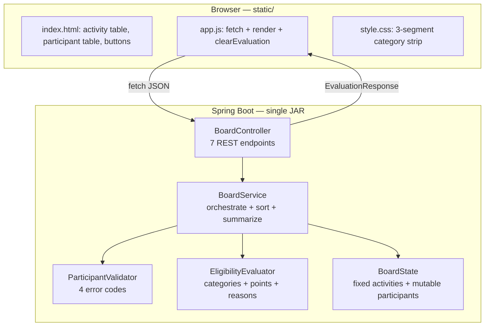

# CampusCertify — College Event Certificate Eligibility Board
## Complete Blueprint & Development Plan

---

## Part 0 — Guide Compliance Map

| Guide requirement | How the plan satisfies it |
|---|---|
| Prompt history (screenshots/copy-paste) | Phase 8 deliverable — chat1.md is already the prompt trail; keep appending |
| Iteration examples (broad → specific) | Real example: "which method is best" → "can we use DB" → "MySQL?" → "what do you prefer" |
| Problem-solving examples | Two design bugs pre-empted: the `.reversed()` comparator trap and the `Set`-swallows-duplicates trap |
| Architecture decisions (prioritize simplicity) | Part 3 gives a *why* for every class; Part 2 lists what was deliberately cut |
| AI influence on design | Part 2 — the first AI proposal was trimmed after reading the guide |
| Trade-offs | Explicit trade-off reasoning on every component |
| Test plan + edge cases | Part 5 test matrix, mapped to all 5 required acceptance criteria |
| Live modification ready | `REQUIRED_POINTS` constant + `Category.values()` iteration make changes one-liners |
| ⚠ Avoid over-engineering | Drove Part 2 revisions — 4 types collapsed to 1, DTO layer cut to a single class, exception handler removed |
| ⚠ Avoid blind copy-paste | Every method has a stated reason, so each line is defensible |

---

## Part 1 — Architecture Overview

**Three layers, not four.** Web → Service → State. That is the minimum that keeps business rules testable without a Spring context — anything fewer would put point-summing inside a controller; anything more is what the guide penalizes.

### Locked decisions
- Backend: Spring Boot 3.x, Java 17+, Maven, `spring-boot-starter-web` + `spring-boot-starter-test` ONLY
- Frontend: static `index.html` + `app.js` + `style.css` served from same JAR, plain fetch, no build step
- Storage: plain in-memory Java collections in ONE `BoardState` class (no interfaces, no DB)
- `POST /api/evaluate` always returns HTTP 200 with envelope `{errors, results, summary}`

---

## Part 2 — Deliberate Simplifications

The guide's *avoid unnecessary layers* rule forced four cuts from the earlier design:

| Cut | Was | Now | Why |
|---|---|---|---|
| Store interfaces | `ActivityStore` + `InMemoryActivityStore` + `ParticipantStore` + `InMemoryParticipantStore` (4 types) | one `BoardState` class | Interfaces exist to enable substitution. There is no second implementation and never will be — the spec forbids persistence-dependent features. 4 types for 2 collections is textbook YAGNI. |
| DTO layer | A DTO per domain type | only `ParticipantDto` | `Activity`, `ParticipantResult` etc. are already immutable records shaped exactly like the JSON. Mapping them to twins adds files that can only introduce drift. `Participant` needs a DTO because inbound JSON carries raw, untrimmed strings. |
| `@ControllerAdvice` | Global exception handler | removed | There are no expected exceptions. Validation errors are *data*, not faults. An unused handler is dead error handling. |
| Persistence | H2 / MySQL considered | plain collections | Spec names "in-memory data structures" as an accepted approach; a DB adds demo-day failure modes and buys nothing the rubric rewards. |

**Kept deliberately:** the validator/evaluator split. It's the only split that earns its keep — they answer different questions ("is the input well-formed?" vs "does this person qualify?"), so eligibility tests never need malformed fixtures and validation tests never need point arithmetic.

---

## Part 3 — Complete Component Design

### 3.1 `domain` package

#### `Category` — enum
Values: `LEARN`, `BUILD`, `SHARE`

- **Why an enum:** closed, fixed set defined by the spec; typos become compile errors.
- **Why this declaration order matters:** it *is* the contracted reason order. Iterating `Category.values()` produces `MISSING_CATEGORY: LEARN, BUILD, SHARE` for free — no hand-maintained ordering list that can drift.
- **Why `EnumSet` downstream:** bitset-backed, and its iteration order follows declaration order, so ordering correctness is structural rather than something you must remember.

#### `Activity` — record (immutable)
| Field | Type | Why |
|---|---|---|
| `id` | `String` | Matches the spec's `A01` format; used as map key |
| `name` | `String` | Display only |
| `category` | `Category` | Enum, not String — makes coverage a set operation |
| `points` | `int` | Whole numbers only in the spec; `int` avoids floating-point comparison risk exactly at the `>= 6` boundary |

**Why a record:** the activity table is fixed by the spec, so immutability models reality; free `equals`/`hashCode`/`toString` for test assertions; zero boilerplate.

#### `Participant` — mutable class (not a record)
| Field | Type | Why |
|---|---|---|
| `id` | `String` | Trimmed at the boundary |
| `name` | `String` | Trimmed at the boundary |
| `completedActivityIds` | `List<String>` | **Most important type decision in the project** |

- **Why a mutable class, not a record:** the UI edits it live (add A04 to C05, clear C01's list). A record would force full reconstruction on every keystroke.
- **Why `List<String>` and NOT `Set<String>`:** a `Set` would silently deduplicate a second `A01`, making `DUPLICATE_PARTICIPATION` **physically undetectable** — and that's a *required* acceptance scenario. The data structure must be able to hold the invalid state in order to report it.
- **Why `String` IDs and NOT `Activity` object references:** an unknown ID like `"A99"` has no corresponding `Activity` object, so an object reference cannot represent it — yet you must report `UNKNOWN_ACTIVITY` with the offending value. Storing raw IDs keeps invalid states representable, which is a precondition for validating them.

#### `ErrorCode` — enum
`INVALID_PARTICIPANT`, `DUPLICATE_PARTICIPANT_ID`, `UNKNOWN_ACTIVITY`, `DUPLICATE_PARTICIPATION`

**Why an enum, not a String:** the spec names exactly four codes — a closed set. Tests assert on the enum, not on fragile string literals.

#### `ValidationError` — record
| Field | Type | Why |
|---|---|---|
| `code` | `ErrorCode` | The contracted code |
| `participantId` | `String` | Spec: report "with the participant" |
| `offendingValue` | `String` | Spec: report "and offending value" (e.g. `A01`, `A99`, or the blank name) |

**Why structured instead of a pre-formatted message string:** formatting is a presentation concern — the UI decides wording, and tests assert on `code` without brittle string matching.

#### `ParticipantResult` — record
| Field | Type | Why |
|---|---|---|
| `participantId` | `String` | Sort key |
| `participantName` | `String` | Display |
| `totalPoints` | `int` | Acceptance criteria assert 7/6/7/7/4 |
| `coveredCategories` | `Set<Category>` | Drives the optional 3-segment strip from **the same derived set** the spec requires — no second derivation in JS that could disagree |
| `eligible` | `boolean` | Primary sort key |
| `failureReasons` | `List<String>` | **`List`, not `Set`** — order is contractual. Pre-formatted server-side so the exact strings live in exactly one place |

#### `EvaluationSummary` — record
| Field | Type |
|---|---|
| `eligibleCount` | `int` |
| `ineligibleCount` | `int` |

**Why a server-side record rather than counting in JS:** single source of truth, unit-testable, and "counts cleared on error" becomes one `if` in one place instead of a UI rule you can forget.

#### `EvaluationResponse` — record (the envelope)
| Field | Type |
|---|---|
| `errors` | `List<ValidationError>` |
| `results` | `List<ParticipantResult>` |
| `summary` | `EvaluationSummary` (null when errors present) |

**Why an envelope with an always-200 response:** the contract *"Any input error clears result rows and counts"* becomes a **structural invariant** — if `errors` is non-empty, `results` is empty and `summary` is null. The frontend gets exactly one render path instead of a success path plus an error path that must remember to clear state. This is the single highest-leverage design decision in the whole project.

---

### 3.2 `state` package

#### `BoardState` — `@Component`
| Field | Type | Why |
|---|---|---|
| `activities` | `LinkedHashMap<String, Activity>` | One structure does two jobs: O(1) lookup for point summing **and** stable display order for the fixed table |
| `participants` | `LinkedHashMap<String, Participant>` | O(1) lookup for edit/delete by ID, plus deterministic pre-sort order so screenshots are reproducible |

| Method | Purpose | Why |
|---|---|---|
| `List<Activity> activities()` | Fixed table, unmodifiable view | Spec says activities are fixed — enforce it in the type, not by convention |
| `Optional<Activity> findActivity(String id)` | Lookup | `Optional` makes "unknown activity" an explicit branch instead of a null check |
| `Map<String, Activity> activityIndex()` | Passed into validator/evaluator | Lets those two stay pure functions with no dependency on state |
| `List<Participant> participants()` | Current rows | — |
| `void upsert(Participant p)` | Add or edit | One method for both — the UI does not need to know which |
| `void remove(String id)` | Delete a row | — |
| `void reset()` | Restore built-ins | Calls the shared seeder |
| `private static List<Participant> seedParticipants()` | The 5 built-in rows | **Called by both the constructor and `reset()`** — guarantees "Reset restores the five built-in rows" is byte-identical to startup state. Two separate copies of the seed data is the #1 way this requirement silently breaks. |

**Concurrency note:** single-user local tool → no synchronization. Document the assumption; adding locks would be over-engineering.

---

### 3.3 `service` package

#### `ParticipantValidator` — `@Component`, stateless

| Method | Signature | Produces |
|---|---|---|
| `validate` | `List<ValidationError> validate(List<Participant> all, Map<String,Activity> index)` | All errors, in a stable order |
| `checkIdentity` | private, per participant | `INVALID_PARTICIPANT` |
| `checkUniqueIds` | private, across all | `DUPLICATE_PARTICIPANT_ID` |
| `checkActivities` | private, per participant | `UNKNOWN_ACTIVITY` + `DUPLICATE_PARTICIPATION` |

- **Why return a list instead of throwing:** invalid user input is an *expected* outcome, not an exceptional one. Exceptions-as-control-flow would also make "report the offending value" awkward and force a `@ControllerAdvice` you don't need.
- **Why collect all errors rather than fail fast:** the spec requires naming the participant *and* the offending value; a grader who types two bad rows should see both.
- **Why trimming happens at the boundary (controller mapping), not here:** if `"C01"` and `"C01 "` were both stored, they'd be treated as two different participants and `DUPLICATE_PARTICIPANT_ID` would never fire. Normalizing once on write means every downstream comparison is already canonical.

#### `EligibilityEvaluator` — `@Component`, stateless

| Member | Signature | Why |
|---|---|---|
| `REQUIRED_POINTS` | `static final int = 6` | Named constant, not a magic number — makes the interview's *live modification* ("raise the threshold to 8") a genuine one-line change |
| `evaluate` | `ParticipantResult evaluate(Participant p, Map<String,Activity> index)` | The single public entry |
| `coveredCategories` | private → `EnumSet<Category>` | `EnumSet` iterates in declaration order = the contracted order, for free |
| `totalPoints` | private → `int` | Sums each completed activity's points exactly once |
| `failureReasons` | private → `List<String>` | Iterates `Category.values()`, appends `MISSING_CATEGORY: X` for each absent one, **then** appends `POINTS_BELOW_6` if under threshold |

- **Why `failureReasons` iterates `Category.values()` instead of three hardcoded `if` blocks:** the enum's declaration order already *is* LEARN → BUILD → SHARE, so the required ordering can't be typed wrong. Adding a 4th category live needs **zero** changes here.
- **Why no early return anywhere:** the spec says *"Evaluate both requirements completely rather than stopping at the first failure."* C05 must show `MISSING_CATEGORY: BUILD` **and** `POINTS_BELOW_6`. An early `return` after the category check is the most likely way to fail that criterion.
- **Why a documented precondition instead of defensive null checks:** `evaluate` is only ever called after validation passed, so every ID resolves. Adding "what if the activity is missing?" branches would be unreachable error handling.

#### `BoardService` — `@Service` (orchestrator)

Dependencies (constructor-injected): `BoardState`, `ParticipantValidator`, `EligibilityEvaluator`.

| Method | Purpose |
|---|---|
| `List<Activity> activities()` | Pass-through for the fixed table |
| `List<Participant> participants()` | Pass-through |
| `void addOrUpdate(Participant p)` | Write path |
| `void deleteParticipant(String id)` | Write path |
| `void reset()` | Delegates to `BoardState.reset()` |
| `EvaluationResponse evaluate()` | **The core pipeline** |

**`evaluate()` pipeline — exactly six steps:**
1. Read participants + activity index from `BoardState`
2. `validator.validate(...)`
3. If errors non-empty → return `new EvaluationResponse(errors, List.of(), null)` and **stop**
4. Map each participant through `evaluator.evaluate(...)`
5. Sort
6. Count and return the full envelope

**⚠ The sorting trap — write this test first:**
Use `Comparator.comparing(ParticipantResult::eligible, Comparator.reverseOrder()).thenComparing(ParticipantResult::participantId)`.

Do **not** write `Comparator.comparing(ParticipantResult::eligible).reversed().thenComparing(...)` — `.reversed()` applies to the *whole* chain built so far and will silently reverse your ID ordering too. Boolean natural order is `false < true`, so `reverseOrder()` on the eligible key puts eligible first, and `thenComparing` keeps IDs ascending within each group.

**Why the summary is computed here, not in the controller or JS:** the rule "counts are cleared when input is invalid" then lives in exactly one `if` (step 3), and is covered by a unit test.

---

### 3.4 `web` package

#### `BoardController` — `@RestController`, `@RequestMapping("/api")`

| Verb & path | Method | Returns |
|---|---|---|
| `GET /activities` | `activities()` | `List<Activity>` |
| `GET /participants` | `participants()` | `List<ParticipantDto>` |
| `POST /participants` | `add(@RequestBody ParticipantDto)` | fresh `List<ParticipantDto>` |
| `PUT /participants/{id}` | `update(@PathVariable, @RequestBody ParticipantDto)` | fresh `List<ParticipantDto>` |
| `DELETE /participants/{id}` | `delete(@PathVariable)` | fresh `List<ParticipantDto>` |
| `POST /reset` | `reset()` | fresh `List<ParticipantDto>` |
| `POST /evaluate` | `evaluate()` | `EvaluationResponse` |

- **Why mutating endpoints return the *fresh full list*:** one round trip instead of POST-then-GET, and the UI table can never drift from server state — precisely the *"keep activity definitions, participant inputs… synchronized"* acceptance criterion.
- **Why `POST /evaluate` takes no body:** it evaluates the server's canonical state. The alternative (stateless — browser posts the whole table) is defensible, but *Reset must restore the five built-in rows*, which is naturally server-owned. Mention this fork in the trade-offs write-up.
- **Why activities are read-only (no POST/PUT):** the spec says the activity table is fixed. Not exposing a write endpoint enforces that at the API surface.
- **Why `POST /evaluate` always returns 200:** validation errors are domain output, not HTTP failures. One `fetch().then()` path in JS, no `catch` branch that has to remember to clear results.

#### `ParticipantDto` — record
| Field | Type |
|---|---|
| `id` | `String` (raw, untrimmed) |
| `name` | `String` (raw, untrimmed) |
| `completedActivityIds` | `List<String>` (raw) |

**Why this is the only DTO:** it's the one type whose wire shape genuinely differs from the domain — it carries *untrimmed* input, and trimming into `Participant` is the normalization boundary. Every other type is already an immutable record shaped exactly like its JSON.

---

### 3.5 Frontend — `src/main/resources/static/`

**Why plain HTML/CSS/JS:** the guide says use technology you can explain and debug confidently, and lists complex frameworks under *Areas to Avoid*. No Node, no build step, no CORS — one `mvn spring-boot:run` and the whole app is live.

`app.js` functions:

| Function | Responsibility |
|---|---|
| `loadActivities()` / `renderActivities()` | Fixed table, fetched once on load |
| `loadParticipants()` / `renderParticipants()` | Editable table |
| `onEvaluate()` | POST `/api/evaluate` → hand response to `renderEvaluation` |
| `renderEvaluation(resp)` | **Owns the entire errors-vs-results branch** — the only place that decides what's visible |
| `clearEvaluation()` | Wipes results, progress strips, counts, banner |
| `onReset()` | POST `/api/reset` → reload participants → `clearEvaluation()` |
| `onAddParticipant()` / `onEditActivities()` / `onDeleteParticipant()` | Write actions |
| `categoryStrip(coveredCategories)` | Builds the optional 3-segment LEARN/BUILD/SHARE bar |

- **Critical UI rule:** *every* participant edit calls `clearEvaluation()`. Without it, stale rows survive an edit and you fail *"show no stale result rows or counts."*
- **Why comma-separated text tokens instead of a checklist:** a checkbox list makes it **impossible to enter a duplicate `A01`** — which would make the required `DUPLICATE_PARTICIPATION` acceptance scenario undemonstrable. The input control must be able to express invalid states, or your validation logic can never be shown working.

---

## Part 4 — Phased Development Plan with Git Branches

Branch off `main`, merge back after each checkpoint passes.

### Phase 0 — Scaffold · `chore/00-scaffold`
- [ ] Spring Initializr: Java 17+, Maven, Jar, **Spring Web only**
- [ ] Create packages: `domain`, `state`, `service`, `web`
- [ ] `git init`, first commit
- **Checkpoint:** app boots on :8080

### Phase 1 — Domain · `feat/01-domain-model`
- [ ] `Category`, `Activity`, `Participant`
- [ ] `ErrorCode`, `ValidationError`
- [ ] `ParticipantResult`, `EvaluationSummary`, `EvaluationResponse`
- **Checkpoint:** compiles; assertion that `Category.values()` order is LEARN, BUILD, SHARE

### Phase 2 — State · `feat/02-board-state`
- [ ] `BoardState` with both `LinkedHashMap`s
- [ ] Shared `seedParticipants()` used by constructor **and** `reset()`
- **Checkpoint:** test — mutate, call `reset()`, assert exactly the 5 spec rows return

### Phase 3 — Validation · `feat/03-validation` *(parallel with Phase 4)*
- [ ] `ParticipantValidator` + the 3 private checks
- [ ] Tests for all four error codes
- **Checkpoint:** duplicate `A01` on C01 yields `DUPLICATE_PARTICIPATION` naming C01 and A01

### Phase 4 — Eligibility · `feat/04-eligibility` *(parallel with Phase 3)*
- [ ] `EligibilityEvaluator` + `REQUIRED_POINTS`
- [ ] Tests: oracle, exact-6 boundary, empty list, reason ordering
- **Checkpoint:** C05 returns `BUILD` then `POINTS_BELOW_6`, in that order

### Phase 5 — Orchestration · `feat/05-board-service` *(depends on 2, 3, 4)*
- [ ] `BoardService.evaluate()` six-step pipeline
- [ ] Comparator (watch the `.reversed()` trap)
- [ ] Tests: ordering, summary counts, errors-clear-results
- **Checkpoint:** built-in oracle end-to-end → 2 eligible / 3 ineligible in correct order

### Phase 6 — REST · `feat/06-rest-api` *(depends on 5)*
- [ ] `ParticipantDto` + trimming in the mapping
- [ ] `BoardController`, 7 endpoints
- [ ] MockMvc tests for valid + invalid `/api/evaluate`
- **Checkpoint:** curl `/api/evaluate` returns the expected JSON before any UI exists

### Phase 7 — Frontend · `feat/07-frontend` *(depends on 6)*
- [ ] `index.html`, `app.js`, `style.css`
- [ ] Category progress strip
- **Checkpoint:** all 5 required acceptance scenarios reproduced in the browser

### Phase 8 — Evidence · `docs/08-evidence`
- [ ] Prompt history + iteration narrative
- [ ] Design summary (Parts 1–3 of this document)
- [ ] Screenshots per acceptance scenario + test run output
- [ ] Tag `v1.0-demo`

---

## Part 5 — Test Matrix

| # | Test | Layer | Asserts |
|---|---|---|---|
| 1 | Built-in oracle | `BoardServiceTest` | Totals 7,6,7,7,4; C01+C02 eligible; counts 2/3 |
| 2 | Reason precision | `EligibilityEvaluatorTest` | C03 → only SHARE; C04 → only LEARN; C05 → BUILD then POINTS_BELOW_6 |
| 3 | Point boundary | `EligibilityEvaluatorTest` | Exactly 6 → eligible (proves `>=`, not `>`) |
| 4 | C05 + A04 | `BoardServiceTest` | Total 6, all 3 categories, counts 3/2 |
| 5 | Empty list | `EligibilityEvaluatorTest` | 0 points, 0 categories, all 4 reasons in order |
| 6 | C01 cleared | `BoardServiceTest` | 0 points, 4 reasons, counts 1/4 |
| 7 | Duplicate participation | `ParticipantValidatorTest` + `BoardServiceTest` | Code + C01 + A01; `results` empty, `summary` null |
| 8 | Unknown activity | `ParticipantValidatorTest` | `A99` → `UNKNOWN_ACTIVITY` |
| 9 | Blank / duplicate IDs | `ParticipantValidatorTest` | `INVALID_PARTICIPANT`, `DUPLICATE_PARTICIPANT_ID` |
| 10 | Ordering | `BoardServiceTest` | Eligible first, then ID ascending **within each group** |
| 11 | Reset fidelity | `BoardStateTest` | Post-mutation reset == startup state |
| 12 | API contract | `BoardControllerTest` (MockMvc) | 200 + correct envelope for both valid and invalid input |

Unit tests use **plain constructors, no Spring context** — only `BoardControllerTest` needs `@WebMvcTest`. Fast tests are themselves evidence for the guide's *Testing mindset* criterion.

---

## Part 6 — Scope Boundaries

**In:** fixed activity table, editable participants, Evaluate, category/point progress, ordered results with reasons, summary counts, validation, reset/sample, tests.

**Out (spec forbids):** certificate document generation, event registration, payments, user accounts, authentication, scheduling, database persistence.

---

## Part 7 — Further Considerations

1. **Server-state vs stateless evaluate.** Plan assumes server holds the participant table. Alternative: browser owns the table, `POST /evaluate` is a pure function, `BoardState` disappears entirely. *Recommendation: keep server state* — Reset is naturally server-owned. Strongest "trade-off I considered" talking point.
2. **Progress strip scope.** Marked Optional in the spec. *Recommendation: build it* — ~15 lines of CSS driven by `coveredCategories`, and it visibly demonstrates the "same derived set" requirement.
3. **Prepare for live modification now.** Likely asks: change the threshold (→ `REQUIRED_POINTS`), add a 4th category (→ `Category` enum only), add a new activity (→ `BoardState` seed only). Rehearse each once.

---

## Two Traps To Watch During Implementation
1. `Comparator.reversed()` reverses the *entire* chain — use `Comparator.comparing(key, Comparator.reverseOrder())` instead.
2. `Set<String>` for completed activity IDs makes `DUPLICATE_PARTICIPATION` undetectable — must be `List<String>`.